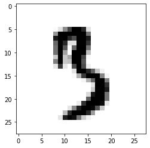
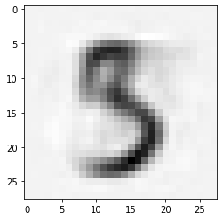
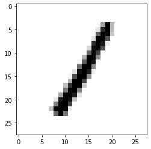
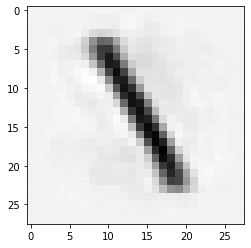

# MNIST Excursions
The objective here is, by dimensionality reduction, to take an image as input and reproduce an image as output by regression. 

## MNIST image to image
The nn learns how to copy **any** image from input to output

## MNIST image to mirrored image
The nn learns the transform how to **mirror** **any** image from input to output

